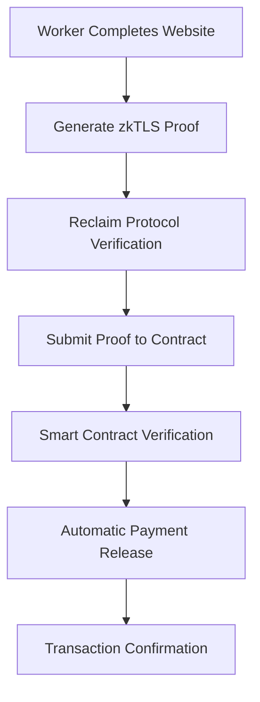

# zkTLS Integration for Automated Work Verification

This document explains how the zkTLS (Zero-Knowledge Transport Layer Security) integration works in the proof-of-work freelance platform to automate work verification and eliminate the need for manual client approval.

## Overview

### The Problem

In traditional freelance platforms, after a worker completes a job (e.g., building a website), they must:

1. Submit proof of completion manually
2. Wait for the client to review and approve the work
3. Risk disputes or delayed payments

### The Solution: zkTLS

With zkTLS integration using Reclaim Protocol, workers can:

1. Submit cryptographic proof that a website exists and contains expected content
2. Get automatic payment release without waiting for client approval
3. Provide tamper-proof evidence of delivery

## How It Works

### 1. zkTLS Proof Generation

When a worker completes website work, they can use zkTLS to prove:

- ✅ The website exists and is accessible
- ✅ The website contains the required content/features
- ✅ The delivery was completed before the deadline
- ✅ The proof is cryptographically verified

### 2. Automated Verification Flow

```
Worker completes website → Generates zkTLS proof → Smart contract verifies proof → Payment released automatically
```

### 3. Technical Implementation

- **Reclaim Protocol**: Provides zkTLS proof generation
- **RUM Contracts**: Store proofs in decentralized way
- **Smart Contract Integration**: Accepts zkTLS proofs for automatic payment release

## Features

### 🔗 Website Verification Templates

Pre-configured templates for common deliverables:

- **Landing Pages**: Verify hero sections, CTAs, responsive design
- **Blog Posts**: Confirm publication, content quality, SEO elements
- **Portfolio Sites**: Check project showcases, about sections, contact forms
- **E-commerce**: Verify product listings, shopping cart, checkout process
- **Documentation**: Ensure guides, API references, search functionality

### 🛡️ Security Benefits

- **Tamper-proof**: Cryptographic proofs cannot be faked
- **Trustless**: No need to trust the worker or client
- **Transparent**: All proofs are verifiable on-chain
- **Real-time**: Instant verification without human intervention

### 💰 Economic Benefits

- **Faster Payments**: Immediate release upon proof verification
- **Reduced Disputes**: Clear, objective proof of delivery
- **Lower Fees**: No need for escrow management or arbitration
- **Better Cash Flow**: Workers get paid immediately upon completion

## Setup Instructions

### 1. Configure Reclaim Protocol

Create a `.env.local` file with your Reclaim credentials:

```bash
# Get these from https://dev.reclaimprotocol.org/
EXPO_PUBLIC_RECLAIM_APP_ID=0x1234567890abcdef1234567890abcdef12345678
EXPO_PUBLIC_RECLAIM_APP_SECRET=0xabcdef1234567890abcdef1234567890abcdef12
```

### 2. Install Dependencies

The necessary packages are already included:

- `@reclaimprotocol/reactnative-sdk`: Core zkTLS functionality
- `react-native-get-random-values`: Cryptographic random number generation

### 3. Smart Contract Integration

The proof-of-work contract supports zkTLS proofs via new message types:

- `submit_zktls_proof`: Submit website delivery proof
- `verify_zktls_proof`: Verify and release payment automatically

## Usage Guide

### For Workers

1. **Complete Your Work**: Finish the website or deliverable
2. **Access Proof Submission**: Go to the job and select "Submit Proof"
3. **Choose zkTLS Verification**: Select the automated verification option
4. **Select Template**: Choose the appropriate website type template
5. **Enter Website URL**: Provide the URL of your completed work
6. **Generate Proof**: Click "Generate Website Proof"
7. **Complete Verification**: Follow the verification process in your browser
8. **Get Paid**: Payment is released automatically upon successful verification

### For Clients

1. **Job Posting**: Include clear deliverable requirements in job description
2. **Automatic Payment**: No action needed - payment releases automatically
3. **Proof Review**: View the cryptographic proof on-chain for transparency
4. **Dispute Resolution**: Use traditional methods only if zkTLS verification fails

## Technical Architecture

### Components

1. **ZKTLSService** (`lib/zkTLS.ts`)

   - Core service for generating and verifying proofs
   - Integrates with Reclaim Protocol SDK
   - Handles RUM contract deployments

2. **ZKTLSVerification** (`components/ZKTLSVerification.tsx`)

   - React Native component for proof generation UI
   - Template selection and configuration
   - User-friendly verification flow

3. **Contract Integration** (`constants/contracts.ts`)
   - New message types for zkTLS proofs
   - Configuration for Reclaim Protocol
   - Smart contract addresses and settings

### Data Flow

```
1. Worker inputs website URL and selects template
2. ZKTLSService generates Reclaim proof request
3. User completes verification in browser
4. Proof is submitted to smart contract
5. Contract verifies proof and releases payment
6. Transaction recorded on XION blockchain
```

### Verification Process



## Benefits by User Type

### For Workers

- ⚡ **Instant Payment**: Get paid immediately upon completion
- 🔒 **Dispute Protection**: Cryptographic proof protects against false claims
- 🚀 **Faster Turnaround**: No waiting for client approval
- 📈 **Better Cash Flow**: Immediate access to earnings

### For Clients

- 🛡️ **Quality Assurance**: Automated verification ensures deliverables meet standards
- 💰 **Cost Effective**: No need for manual review time
- 📊 **Transparent Process**: All proofs are verifiable and auditable
- ⚖️ **Fair Payments**: Automatic release only when work is proven complete

### For Platform

- 🔄 **Automated Operations**: Reduced need for manual intervention
- 📉 **Lower Support Costs**: Fewer disputes and payment issues
- 🎯 **Better User Experience**: Faster, more reliable payment system
- 🌐 **Competitive Advantage**: Unique automation capability

## Supported Deliverable Types

### Currently Supported

- ✅ **Websites**: Landing pages, portfolios, blogs, e-commerce
- ✅ **Web Applications**: SPAs, dashboards, admin panels
- ✅ **Documentation Sites**: Technical docs, API references
- ✅ **Static Sites**: Marketing pages, company websites

### Future Support (Roadmap)

- 🔄 **Mobile Apps**: App store deployments
- 🔄 **APIs**: Endpoint functionality verification
- 🔄 **Smart Contracts**: On-chain deployment verification
- 🔄 **Content Creation**: Blog posts, articles, social media

## Configuration Reference

### Environment Variables

| Variable                                | Description                       | Required | Example     |
| --------------------------------------- | --------------------------------- | -------- | ----------- |
| `EXPO_PUBLIC_RECLAIM_APP_ID`            | Reclaim Protocol App ID           | Yes      | `0x1234...` |
| `EXPO_PUBLIC_RECLAIM_APP_SECRET`        | Reclaim Protocol App Secret       | Yes      | `0xabcd...` |
| `EXPO_PUBLIC_TREASURY_CONTRACT_ADDRESS` | Treasury contract for gasless txs | No       | `xion1...`  |

### Smart Contract Addresses

| Contract      | Address                                                           | Purpose                     |
| ------------- | ----------------------------------------------------------------- | --------------------------- |
| Proof of Work | `xion1x9wlxg2xs9ft0h20z7t6rmnexhzwwws3qgkmm2j803rcdr4jrrys4gt6cv` | Main job contract           |
| Verification  | `xion1qf8jtznwf0tykpg7e65gwafwp47rwxl4x2g2kldvv357s6frcjlsh2m24e` | zkTLS verification          |
| RUM Code ID   | `1289`                                                            | Decentralized proof storage |

## Security Considerations

### Cryptographic Security

- **Zero-Knowledge Proofs**: No sensitive data is revealed during verification
- **TLS Verification**: Ensures authentic communication with websites
- **Tamper Resistance**: Proofs cannot be modified or faked
- **Blockchain Immutability**: All proofs are permanently recorded

### Privacy Protection

- **Minimal Data**: Only necessary website data is captured
- **User Control**: Workers choose what to verify and when
- **No Personal Info**: No personal data is stored in proofs
- **Selective Disclosure**: Only relevant content is proven

### Attack Mitigation

- **Replay Protection**: Each proof is unique and time-bound
- **Sybil Resistance**: Cryptographic identity verification
- **MEV Protection**: Front-running is not profitable
- **Smart Contract Audits**: All contracts are audited for security

## Troubleshooting

### Common Issues

1. **Proof Generation Fails**

   - Check internet connection
   - Verify website is publicly accessible
   - Ensure Reclaim credentials are correct

2. **Verification Timeout**

   - Complete verification process quickly
   - Check browser for popup blockers
   - Try using a different browser

3. **Contract Submission Fails**
   - Verify wallet connection
   - Check XION network status
   - Ensure sufficient gas fees

### Error Codes

| Code           | Description              | Solution                    |
| -------------- | ------------------------ | --------------------------- |
| `RECLAIM_001`  | Invalid App ID           | Check environment variables |
| `RECLAIM_002`  | Proof generation timeout | Retry with stable internet  |
| `CONTRACT_001` | Insufficient gas         | Add XION to wallet          |
| `CONTRACT_002` | Invalid proof format     | Regenerate proof            |

## Roadmap

### Phase 1: Current Implementation ✅

- Basic website verification
- Manual proof submission
- Template system
- Smart contract integration

### Phase 2: Enhanced Automation 🔄

- Automatic proof submission
- Webhook integration
- Advanced templates
- Multi-step verification

### Phase 3: Advanced Features 🔮

- AI-powered content verification
- Multi-platform support
- Batch verification
- Advanced analytics

## Support

For technical support or questions:

- 📧 Email: support@your-platform.com
- 📘 Documentation: https://docs.your-platform.com
- 💬 Discord: https://discord.gg/your-platform
- 🐛 Issues: https://github.com/your-org/proof-of-work/issues

## Contributing

We welcome contributions to improve zkTLS integration:

1. Fork the repository
2. Create a feature branch
3. Implement your changes
4. Add tests and documentation
5. Submit a pull request

## License

This zkTLS integration is released under the MIT License. See LICENSE for details.

---

_Last updated: December 2024_
